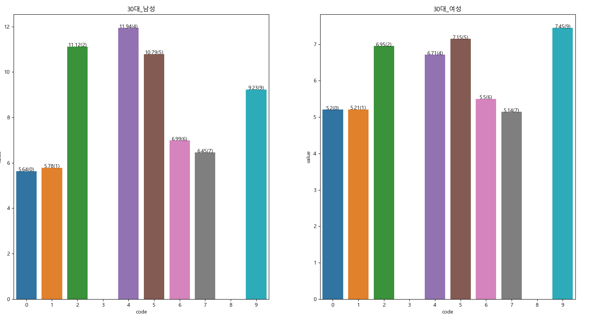
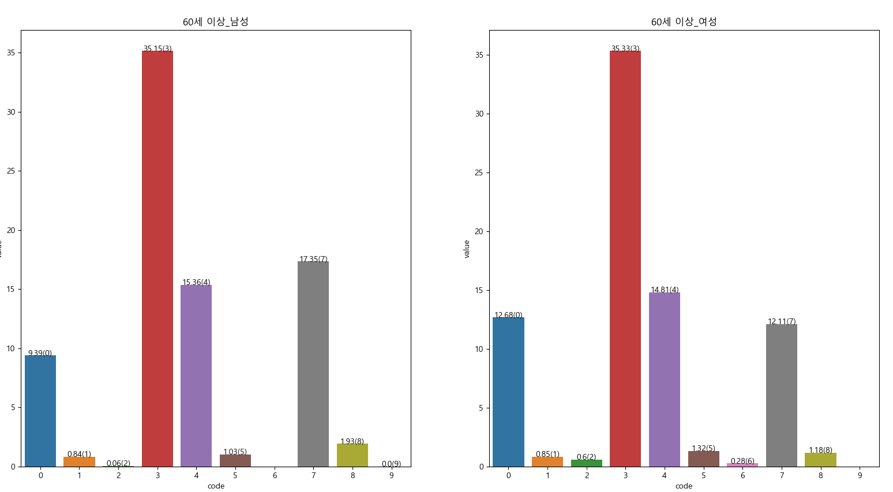

# 데이터 분석

> :question: ​나이에 따른 도서 취향이 다른가?
>
> :question: ​성별에 따른 도서 취향이 다른가?
>
> :question: ​나이_성별에 따른 도서 취향이 다른가?
>
> :question: ​시간에 따라 사람들의 인기 도서 장르가 바뀌는가?

## ISBN_ADD 정보

### ISBN_ADD1

> 

### ISBN_ADD2

> 

### ISBN_ADD3

> 

# 시각화로 확인 (2019 9월 1주차 기준 )

> 1. 나이_성별 과 isbn 부가기호로 행렬을 나누었음
> 2. 점수는 ranking 에 따라 가중치를 부여하였음. (1등 부터 200등)
> 3. 가중치는 MaxMin scaler 를 통하여 0 ~ 1로 조정.
> 4. 나중에 나이와 성별을 따로 구분하여 확인할 것임.
> 5. 아주 단순하게 bar 차트로 확인 후 차후에 개선할 것

### 8 ~ 13세

#### ISBN_ADD1

> 독자대상기호로 구분해 봤을 때 큰 차이점이 없다. 가장 높은 두 가지는`청소년, 전문`을 대상으로한 책이다.

#### ISBN_ADD2

> 아동들은 `책사이즈가 작은 것, 그림책`을 선호함을 알 수 있다.

#### ISBN_ADD3

> 아동들의 도서 취향은 성별에 관계 없이 비슷했다.
>
> 가장 선호하는 장르는 `영미문학, 자연과학, 철학`에 관한 책이었다.
>
> 차이점을 보이는 부분은 아동(여)는 `생활과학, 의복, 미용` 과 `문학 일반`에 관한 관심도가 아동(남) 보다 높았다.

### 14 ~ 19세

#### ISBN_ADD1

> * 청소년들의 경우 남여 모두 전반적으로 `여성, 학습용 서적, 아동`에 관심이 많은 것을 알 수 있다.

#### ISBN_ADD2

> `단행본` 서적을 가장 많이 선호하며 `그림책, 문고본, 시리즈물`의 서적을 많이 빌렸다.

> 남녀 모두 `한국문학, 순수과학, 의복 및 화장`에 관한 서적을 선호하는 것을 알 수 있다.
>
> 남녀에서 가장 두드러지는 차이는 청소년 남자들의 `순수과학, 수학`에 관한 관심도가 여성 보다 높은 것을 알 수 있다.

### 20세

#### ISBN_ADD1

> 20대 남성의 경우 `학습참고서2` 서적을 가장 선호했으며 여성의 경우 `학습참고서2, 아동` 서적을 선호했다. (생각한 것과 달라서 이 부분은 데이터 수집, 또는 전처리 과정에서 잘못했을 가능성 있음)

> 남성 여성 모두 `단행본, 시리즈물, 그림책`을 많이 빌린다.

> 20대 부터 남성과 여성의 선호 장르가 차이를 보인다.
>
> 둘 모두 `한국문학`을 가장 많이 빌리는 것을 알 수 있다. 

### 30세

### 40세

### 50세

### 60세 이상

